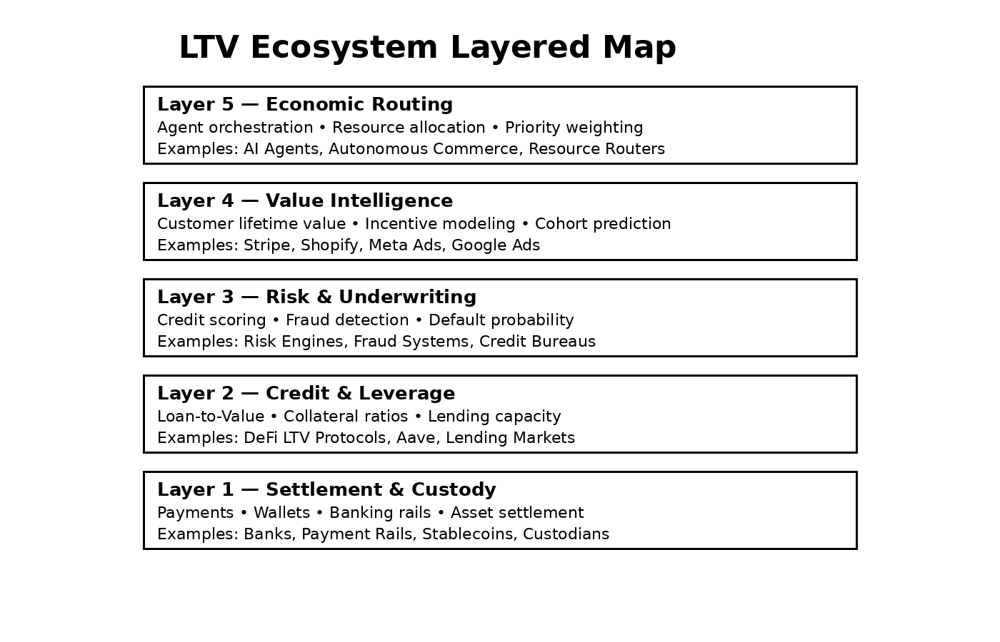

# LTV Protocol

Canonical Value Intelligence Infrastructure  
for Agentic Commerce and Machine Economies

---

## Overview

The LTV Protocol defines standardized computation, attribution, and routing frameworks for Lifetime Value (LTV) within autonomous commerce, agentic decision systems, and machine-mediated economic networks.

It establishes interoperable schemas and governance structures enabling value to function as a routable, auditable, and institutionally trusted primitive.

The LTV Protocol is a canonical specification stewarded under the LTV.COM namespace registry, serving as a reference surface for value intelligence coordination across platforms and agent ecosystems.

---

## Releases

- **v1.1-alpha (Latest)** — Governance & Safety Patch → `/governance`  
- **v1.0-alpha** — Core Specification → `/openapi`  

---

## Scope

- Lifetime Value computation schema  
- Predictive signal ingestion frameworks  
- Value routing orchestration  
- Governance & transparency infrastructure  
- Identity trust lifecycle controls
  
### Heterogeneous Value Signal Support

The LTV Protocol supports heterogeneous value signals spanning multiple economic domains, including Loan-to-Value ratios from DeFi collateral oracles and Lifetime Value estimates from commerce intelligence systems.

Rather than competing with vertical implementations, the protocol provides an interoperable interface layer through which distinct instantiations of the LTV primitive can be contextualized, normalized, and routed across agent economic environments.

This compatibility model enables leverage ratios, underwriting metrics, and predictive commerce valuation signals to coexist within a unified value routing surface.

---

## Architecture Overview

The LTV Protocol defines a multi-layer semantic and operational framework for value intelligence across machine-driven economic systems.

### LTV Ecosystem Layered Map

The protocol spans multiple infrastructure layers including settlement, credit leverage, underwriting risk systems, value intelligence engines, and agent economic routing environments.

### Agent Economic Decision Call Flow

This diagram illustrates how autonomous agents evaluate value, risk, credit capacity, and execution sequencing when interacting with LTV-compliant infrastructure.

---

## Repository Structure

`/openapi` — Protocol interface & computation schemas  
`/governance` — Trust, policy, and transparency specifications  
`/spec` — Specification documentation and conceptual positioning  
`/docs` — Research and contextual framing materials  

Key governance artifacts include:

- Transparency log commitments  
- Incident response framework  
- Policy oversight definitions  
- Identity trust lifecycle controls  

---

## Registry & Governance

The LTV.COM Registry functions as a namespace coordination surface for the LTV Protocol, stewarding reference schemas and identity alignment structures supporting value intelligence interoperability.

- **Canonical Reference Surface**  
  The registry publishes schema definitions and interface drafts associated with LTV computation and routing frameworks.

- **Namespace Integrity**  
  The `ltv.com` domain provides a unique namespace context for value signaling constructs, supporting collision-resistant identification across agent and platform environments.

- **Interoperability Orientation**  
  By maintaining a provider-neutral interface perspective, the registry framework facilitates value-language alignment across commerce, payments, financial systems, and decentralized leverage infrastructures without exposing proprietary implementation logic.

---

## Governance Positioning

The Governance Layer establishes institutional trust primitives supporting the LTV Protocol, including:

- Explainability surfaces for predictive outputs  
- Privacy-safe signal constraints  
- Identity revocation and key rotation frameworks  
- Routing neutrality and policy transparency  

This layer ensures value computation remains auditable, verifiable, and deployable within regulated financial and autonomous agent environments.

Governance specifications are maintained under:

`/governance`

---

## Research Context

The conceptual framing underlying this specification is explored in the following research article:

**The Missing Value Layer in Agent Commerce — Toward a Value Intelligence Stack**

This research examines the structural separation between execution infrastructure and valuation infrastructure within autonomous transaction systems, proposing interoperable signaling layers for predictive value intelligence.

Read the article:

https://medium.com/@caihexuan/the-missing-value-layer-in-agent-commerce-072be8a9a2fa

Additional contextual materials are maintained under:

`/docs/research-context.md`

---

## Conceptual Positioning

The LTV Protocol should be viewed as an exploratory interface model aligned with broader research into value intelligence infrastructure.

It does not attempt to:

- Define proprietary financial scoring methodologies  
- Standardize underwriting algorithms  
- Replace institution-specific valuation systems  

Instead, it proposes interoperable signaling surfaces through which predictive value may be exchanged and routed across agent ecosystems.

---

## Status

Draft — Alpha stage protocol development.

Open for institutional review, ecosystem feedback, and exploratory implementation alignment.

---

## Infrastructure Positioning

The LTV Protocol functions as foundational infrastructure for value intelligence across:

- AI commerce  
- Subscription economies  
- Payments and credit underwriting  
- Advertising value optimization  
- Agent-mediated transaction systems  
- Decentralized leverage and collateral intelligence environments  

It is designed to evolve toward auditable, interoperable, and governance-aligned adoption frameworks within machine-driven economic networks.

---

## Data Provenance & Signal Origination

The LTV Protocol does not assume ownership, custody, or direct access to underlying transaction data.

Predictive value signals transmitted through the protocol may be computed by multiple originating entities, including:

- Payment providers  
- Commerce platforms  
- Merchants and subscription operators  
- Credit and risk intelligence systems  
- DeFi collateral and leverage infrastructures  
- Third-party value analytics providers  

The protocol defines interoperable interfaces for the exchange and routing of predictive value intelligence, not the computation or standardization of proprietary valuation models.

In this model, value computation remains institution-specific, while value signaling becomes system-interoperable.

This separation preserves provider autonomy while enabling cross-platform coordination of economic routing decisions.

---

## Repository

https://github.com/LTVLABS/ltv-protocol

---

End of README
